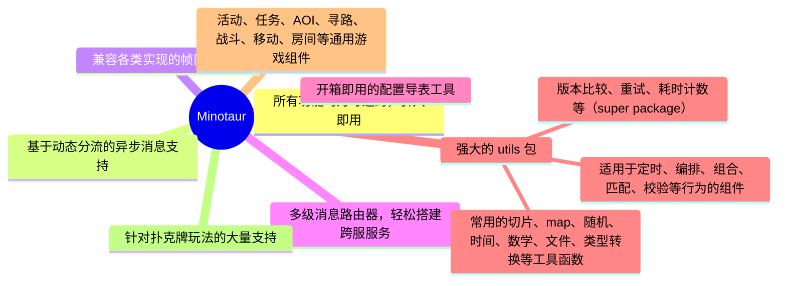

# Minotaur

Minotaur 是一个用于服务端开发的支持库，其中采用了大量泛型设计，主要被用于游戏服务器开发，但由于拥有大量通用的功能，也常被用于 WEB 开发。
***

[](https://pkg.go.dev/github.com/kercylan98/minotaur)

<a target="_blank" href="https://goreportcard.com/report/github.com/kercylan98/minotaur"></a>


> - 这是支持快速搭建多功能服务器的 `Golang` 服务端框架，支持 WebSocket、TCP、UDP、KCP、HTTP 等常见网络协议；
> - 网络传输基于 [`panjf2000/gnet`](https://github.com/panjf2000/gnet)、[`xtaci/kcp-go`](https://github.com/xtaci/kcp-go) 构建；
> - 该项目的目标是提供一个简单、高效、可扩展的游戏服务器框架，让开发者可以专注于游戏逻辑的开发，而不用花费大量时间在网络传输、配置导表、日志、监控等基础功能的开发上；

## 特色内容


## Server 架构预览


## 安装
注意：依赖于 **[Go](https://go.dev/) 1.22 +**

运行以下 Go 命令来安装软件包：`minotaur`
```sh
$ go get -u github.com/kercylan98/minotaur
```

## 用法
- 在`Minotaur`中大量使用了 **[泛型](https://go.dev/doc/tutorial/generics)** 、 **[观察者(事件)](https://www.runoob.com/design-pattern/observer-pattern.html)** 和 **[选项模式](https://juejin.cn/post/6844903729313873927)**，在使用前建议先进行相应了解；
- 项目文档可访问 **[pkg.go.dev](https://pkg.go.dev/github.com/kercylan98/minotaur)** 进行查阅；

### 本地文档
可使用 `godoc` 搭建本地文档服务器
#### 安装 godoc
```shell
git clone golang.org/x/tools
cd tools/cmd
go install ...
```
#### 使用 `godoc` 启动本地文档服务器
```shell
godoc -http=:9998 -play
```
#### Windows
```shell
.\local-doc.bat
```

#### Linux or MacOS
```shell
chmod 777 ./local-doc.sh
./local-doc.sh
```

#### 文档地址
- **[http://localhost:9998/pkg/github.com/kercylan98/minotaur/](http://localhost:9998/pkg/github.com/kercylan98/minotaur/)**
- **[https://pkg.go.dev/github.com/kercylan98/minotaur](https://pkg.go.dev/github.com/kercylan98/minotaur)**

### 简单回响服务器
创建一个基于`Websocket`创建的单线程回响服务器。

```go
package main

import (
	"github.com/kercylan98/minotaur/server"
	"github.com/kercylan98/minotaur/server/network"
)

func main() {
	srv := server.NewServer(network.WebSocket(":8080/echo"))
	srv.RegisterConnectionReceivePacketEvent(func(srv server.Server, conn server.Conn, packet server.Packet) {
		conn.AsyncWritePacket(packet)
	})
	if err := srv.Run(); err != nil {
		panic(err)
	}
}
```
访问 **[WebSocket 在线测试](http://www.websocket-test.com/)** 进行验证。
> Websocket地址: ws://127.0.0.1:8080/echo

### Server 消息机制（ 类 Actor ）

`Minotaur` 中的消息处理机制是类似于 `Actor` 的概念，一切调用在 `Server` 中都是通过向 `Topic` 投递消息的方式来进行的，具体特色如下：

> - 暴露了消息驱动的接口，可以高度自定义消息处理逻辑；
> - 在每个 `Topic` 中，消息处理是串行化的，确保了操作的顺序性和状态的一致性，同时避免了多线程带来的竞态条件和锁竞争；
> - 尽管每个 `Topic` 是串行处理，但多个 `Topic` 可以同时独立处理消息，支持多种场景下的高性能需求；
> - 不同的 `Topic` 之间不进行状态的共享，避免了竞态条件和锁竞争的风险，确保系统的稳定性；
> - 采用了无界缓冲区的设置，支持循环嵌套的消息投递，可以实现复杂的消息处理逻辑，同时也避免了消息管道的递归阻塞问题；

#### 不同 `Topic` 之间的状态共享：

**举个栗子，假设在聊天室场景中我们加入个人积分的功能，而积分的来源我们分为如下几种：**
 - 每日签到
 - 参与聊天发言
 - 被赠送礼物

_其中，每日签到和参与聊天发言涉及单个用户自身的操作，不需要跨用户的状态共享。这些操作在用户自己的 Topic 中串行
处理即可。然而，被赠送礼物涉及到跨用户的交互，需要考虑积分修改和事件通知。我们通过中间模块来组织这个过程。_

##### 模块化设计
模块作为中间层，接受各个 `Topic` 的调用，并可以投递消息到其他 `Topic`，同时也可以暴露事件给其他 `Topic`。

> - 礼物模块：礼物模块提供赠送礼物的接口，同时暴露收到礼物的事件。这个模块处理礼物的发送和接收，并确保跨 `Topic` 的交互。
> - 积分模块：积分模块负责管理用户的积分，并监听礼物模块的收到礼物事件。它根据事件内容来更新积分，然后暴露积分变化事件。
> - 聊天室模块：聊天室模块是用户交互的核心模块，负责处理聊天相关的操作。它可以注册积分模块的积分变化事件，确保用户在收到积分变化时得到及时反馈。

##### 送礼与积分修改的流程
> - 用户间的消息传递：当送礼人在礼物模块中执行送礼操作时，系统会向接收者的 `Topic` 投递消息。这条消息包含收礼人的信息以及礼物的内容。
> - 积分更新：积分模块监听礼物模块的收到礼物事件，接收到礼物消息后，更新相应用户的积分，并触发积分变化事件。 
> - 通知机制：聊天室模块注册了积分模块的积分变化事件。当事件触发时，聊天室模块可以根据需要进行操作，例如发送通知或更新用户界面。

##### 串行化处理与并发
> - 由于每个 `Topic` 的消息处理是串行化的，确保了操作的顺序性和状态的一致性。即使跨模块的操作，也不会出现竞态条件或锁竞争的问题。事件驱动机制确保模块之间的松耦合，支持灵活的事件响应。

### 慢消息及死锁检测追踪
在服务器开发过程中，慢消息和死锁是常见的问题，`Minotaur` 内置了对慢消息和死锁的检测，可通过`server.NewOptions().WithEventOptions`进行设置。

```go
package main

import (
	"github.com/kercylan98/minotaur/server"
	"github.com/kercylan98/minotaur/server/network"
	"github.com/kercylan98/minotaur/toolkit/nexus"
	"time"
)

func main() {
	server.NewServer(network.WebSocket(":8080"), server.NewOptions().
		WithEventOptions(nexus.NewEventOptions().
			WithLowHandlerTrace(true, func(cost time.Duration, stack []byte) {

			}).
			WithLowHandlerThreshold(time.Millisecond*200, func(cost time.Duration) {

			}).
			WithDeadLockThreshold(time.Second*5, func(stack []byte) {

			}),
		),
	)
}
```
> 在开启死锁检测的时候需要设置一个合理的死锁怀疑时间，该时间内消息没有处理完毕则会触发死锁检测，并打印`WARN`级别的日志输出。

### 计时器
在默认的`server.Server`不会包含计时器功能，可通过`server.WithTicker`进行开启，例如：
```go
package main

import "github.com/kercylan98/minotaur/server"

func main() {
	srv := server.New(server.NetworkWebsocket, server.WithTicker(-1, 50, 10, false))
	if err := srv.Run(":9999"); err != nil {
		panic(err)
	}
}
```
也可以通过`timer.GetTicker`获取计时器进行使用，例如：
```go
package main

import (
	"fmt"
	"github.com/kercylan98/minotaur/utils/timer"
	"github.com/kercylan98/minotaur/utils/times"
	"sync"
)

func main() {
	var ticker = timer.GetTicker(10)
	var wait sync.WaitGroup
	wait.Add(3)
	ticker.Loop("LOOP", timer.Instantly, times.Second, timer.Forever, func() {
		fmt.Println("LOOP")
		wait.Done()
	})
	wait.Wait()
}
```
在分布式环境中，如果存在类似于多服务器需要同时间刷新配置时，可使用`Cron`表达式设置定时任务。

### 基于`xlsx`文件的配置导出工具
该导出器的`xlsx`文件配置使用`JSON`语法进行复杂类型配置，具体可参考图例
- **[`planner/pce/exporter`](planner/pce/exporter)** 是实现了基于`xlsx`文件的配置导出工具，可直接编译成可执行文件使用；
- **[`planner/pce/exporter/xlsx_template.xlsx`](planner/pce/exporter/xlsx_template.xlsx)** 是导出工具的模板文件，其中包含了具体的规则说明。
- 模板文件图例：
  

#### 导出 JSON 文件（可供客户端直接使用，包含索引的配置导出后为键值模式，可直接读取）
```text
Flags:
  -e, --exclude string   excluded configuration names or display names (comma separated) | 排除的配置名或显示名（英文逗号分隔）
  -h, --help             help for json
  -o, --output string    directory path of the output json file | 输出的 json 文件所在目录路径
  -p, --prefix string    export configuration file name prefix | 导出配置文件名前缀
  -t, --type string      export server configuration[s] or client configuration[c] | 导出服务端配置[s]还是客户端配置[c]
  -f, --xlsx string      xlsx file path or directory path | xlsx 文件路径或所在目录路径

```
```shell
expoter.exe json -t s -f xlsx_template.xlsx -o ./output
```
导出结果示例
```json
{
  "1": {
    "b": {
      "Id": 1,
      "Count": "b",
      "Info": {
        "id": 1,
        "name": "小明",
        "info": {
          "lv": 1,
          "exp": {
            "mux": 10,
            "count": 100
          }
        }
      },
      "Other": [
        {
          "id": 1,
          "name": "张飞"
        },
        {
          "id": 2,
          "name": "刘备"
        }
      ]
    }
  }
}

```

#### 导出 Golang 文件
```text
Flags:
  -e, --exclude string   excluded configuration names or display names (comma separated) | 排除的配置名或显示名（英文逗号分隔）
  -h, --help             help for go
  -o, --output string    output path | 输出的 go 文件路径
  -f, --xlsx string      xlsx file path or directory path | xlsx 文件路径或所在目录路径
```
```shell
expoter.exe go -f xlsx_template.xlsx -o ./output
```
使用示例

```go
package main

import (
	"fmt"
	"config"
)

func main() {
	fmt.Println(config.EasyConfig.Id)
}
```

### 持续更新的示例项目
- **[Minotaur-Example](https://github.com/kercylan98/minotaur-example)**

### 贡献者列表
<a href="https://github.com/kercylan98/minotaur/graphs/contributors">
  
</a>

#### 参与贡献请参考 **[CONTRIBUTING.md](CONTRIBUTING.md)** 贡献指南。

### 联系方式
- **[Email: kercylan@gmail.com](mailto:kercylan@gmail.com)**
- **[Telegram: ziv_siren](https://telegram.me/ziv_siren)**

# JetBrains OS licenses

`Minotaur` had been being developed with `GoLand` IDE under the **free JetBrains Open Source license(s)** granted by JetBrains s.r.o., hence I would like to express my thanks here.

<a href="https://www.jetbrains.com/?from=minotaur" target="_blank"></a>