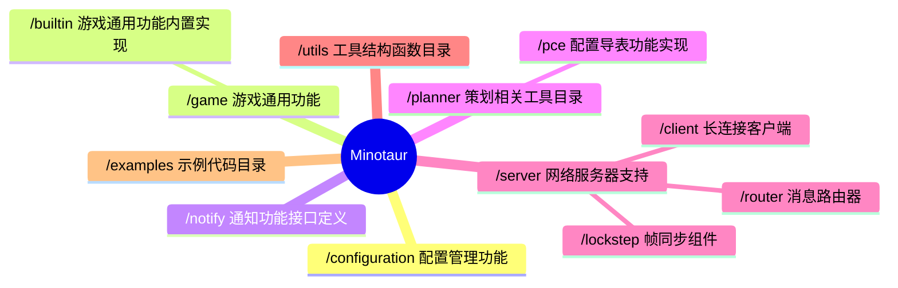
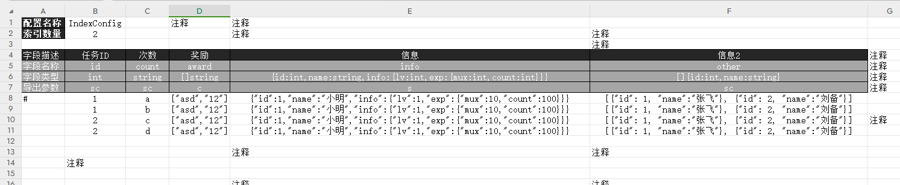

# Minotaur

[](https://pkg.go.dev/github.com/kercylan98/minotaur)


<a target="_blank" href="https://goreportcard.com/report/github.com/kercylan98/minotaur"></a>

Minotaur 是一个基于Golang 1.20 编写的服务端开发支持库，其中采用了大量泛型设计，用于游戏服务器开发。

## 目录结构概况


## Server 架构预览


## 安装
注意：依赖于 **[Go](https://go.dev/) 1.20 +**

运行以下 Go 命令来安装软件包：`minotaur`
```sh
$ go get -u github.com/kercylan98/minotaur
```

## 用法
- 在`Minotaur`中大量使用了 **[泛型](https://go.dev/doc/tutorial/generics)** 、 **[观察者(事件)](https://www.runoob.com/design-pattern/observer-pattern.html)** 和 **[选项模式](https://juejin.cn/post/6844903729313873927)**，在使用前建议先进行相应了解；
- 项目文档可访问 **[pkg.go.dev](https://pkg.go.dev/github.com/kercylan98/minotaur)** 进行查阅；

### 本地文档
可使用 `godoc` 搭建本地文档服务器
#### 安装 godoc
```shell
git clone golang.org/x/tools
cd tools/cmd
go install ...
```
#### 使用 `godoc` 启动本地文档服务器
```shell
godoc -http=:9998 -play
```
#### Windows
```shell
.\local-doc.bat
```

#### Linux or MacOS
```shell
chmod 777 ./local-doc.sh
./local-doc.sh
```

#### 文档地址
- **[http://localhost:9998/pkg/github.com/kercylan98/minotaur/](http://localhost:9998/pkg/github.com/kercylan98/minotaur/)**
- **[https://pkg.go.dev/github.com/kercylan98/minotaur](https://pkg.go.dev/github.com/kercylan98/minotaur)**

### 简单回响服务器
创建一个基于`Websocket`创建的单线程回响服务器。
```go
package main

import (
	"github.com/kercylan98/minotaur/server"
)

func main() {
	srv := server.New(server.NetworkWebsocket)
	srv.RegConnectionReceivePacketEvent(func(srv *server.Server, conn *server.Conn, packet []byte) {
		conn.Write(packet)
	})
	if err := srv.Run(":9999"); err != nil {
		panic(err)
	}
}
```
访问 **[WebSocket 在线测试](http://www.websocket-test.com/)** 进行验证。
> Websocket地址: ws://127.0.0.1:9999

### 分流服务器
分流服务器可以将客户端分流到不同的分组上，每个分组中为串行处理，不同分组之间并行处理。
```go
package main

import "github.com/kercylan98/minotaur/server"

func main() {
	srv := server.New(server.NetworkWebsocket,
		server.WithShunt(func(conn *server.Conn) string {
			return conn.GetData("roomId").(string)
		}),
	)
	srv.RegConnectionReceivePacketEvent(func(srv *server.Server, conn *server.Conn, packet []byte) {
		conn.Write(packet)
	})
	if err := srv.Run(":9999"); err != nil {
		panic(err)
	}
}
```
> 该示例中假设各房间互不干涉，故通过`server.WithShunt`将连接通过`roomId`进行分组，提高并发处理能力。

### 服务器死锁检测
`Minotaur`内置了服务器消息死锁检测功能，可通过`server.WithDeadlockDetect`进行开启。
```go
package main

import (
	"github.com/kercylan98/minotaur/server"
	"time"
)

func main() {
	srv := server.New(server.NetworkWebsocket,
		server.WithDeadlockDetect(time.Second*5),
	)
	srv.RegConnectionReceivePacketEvent(func(srv *server.Server, conn *server.Conn, packet []byte) {
		time.Sleep(10 * time.Second)
		conn.Write(packet)
	})
	if err := srv.Run(":9999"); err != nil {
		panic(err)
	}
}
```
> 在开启死锁检测的时候需要设置一个合理的死锁怀疑时间，该时间内消息没有处理完毕则会触发死锁检测，并打印`WARN`级别的日志输出。

### 计时器
在默认的`server.Server`不会包含计时器功能，可通过`server.WithTicker`进行开启，例如：
```go
package main

import "github.com/kercylan98/minotaur/server"

func main() {
	srv := server.New(server.NetworkWebsocket, server.WithTicker(50, false))
	if err := srv.Run(":9999"); err != nil {
		panic(err)
	}
}
```
也可以通过`timer.GetTicker`获取计时器进行使用，例如：
```go
package main

import (
	"fmt"
	"github.com/kercylan98/minotaur/utils/timer"
	"github.com/kercylan98/minotaur/utils/times"
	"sync"
)

func main() {
	var ticker = timer.GetTicker(10)
	var wait sync.WaitGroup
	wait.Add(3)
	ticker.Loop("LOOP", timer.Instantly, times.Second, timer.Forever, func() {
		fmt.Println("LOOP")
		wait.Done()
	})
	wait.Wait()
}
```

### 流操作
可以通过 `stream` 包快速开启对`切片`和`map`的流式操作，例如：
```go
package main

import (
	"fmt"
	"github.com/kercylan98/minotaur/utils/stream"
	"github.com/kercylan98/minotaur/utils/streams"
)

func main() {
	s := stream.WithSlice([]int{1, 2, 3, 4, 5, 6, 7, 8, 9, 10}).
		Copy().
		Shuffle().
		Filter(true, func(index int, item int) bool {
			return item%2 == 0
		}).
		Zoom(20).
		Each(true, func(index int, item int) bool {
			t.Log(index, item)
			return false
		}).
		Chunk(3).
		EachT(func(index int, item stream.Slice[int]) bool {
			t.Log(item)
			return false
		}).
		Merge().
		FillBy(func(index int, value int) int {
			if value == 0 {
				return 999
			}
			return value
		})
	
	fmt.Println(s)
}
```

### 基于`xlsx`文件的配置导出工具
该导出器的`xlsx`文件配置使用`JSON`语法进行复杂类型配置，具体可参考图例
- **[`planner/pce/exporter`](planner/pce/exporter)** 是实现了基于`xlsx`文件的配置导出工具，可直接编译成可执行文件使用；
- **[`planner/pce/exporter/xlsx_template.xlsx`](planner/pce/exporter/xlsx_template.xlsx)** 是导出工具的模板文件，其中包含了具体的规则说明。
- 模板文件图例：


#### 导出 JSON 文件（可供客户端直接使用，包含索引的配置导出后为键值模式，可直接读取）
```text
Flags:
  -e, --exclude string   excluded configuration names or display names (comma separated) | 排除的配置名或显示名（英文逗号分隔）
  -h, --help             help for json
  -o, --output string    directory path of the output json file | 输出的 json 文件所在目录路径
  -p, --prefix string    export configuration file name prefix | 导出配置文件名前缀
  -t, --type string      export server configuration[s] or client configuration[c] | 导出服务端配置[s]还是客户端配置[c]
  -f, --xlsx string      xlsx file path or directory path | xlsx 文件路径或所在目录路径

```
```shell
expoter.exe json -t s -f xlsx_template.xlsx -o ./output
```
导出结果示例
```json
{
  "1": {
    "b": {
      "Id": 1,
      "Count": "b",
      "Info": {
        "id": 1,
        "name": "小明",
        "info": {
          "lv": 1,
          "exp": {
            "mux": 10,
            "count": 100
          }
        }
      },
      "Other": [
        {
          "id": 1,
          "name": "张飞"
        },
        {
          "id": 2,
          "name": "刘备"
        }
      ]
    }
  }
}

```

#### 导出 Golang 文件
```text
Flags:
  -e, --exclude string   excluded configuration names or display names (comma separated) | 排除的配置名或显示名（英文逗号分隔）
  -h, --help             help for go
  -o, --output string    output path | 输出的 go 文件路径
  -f, --xlsx string      xlsx file path or directory path | xlsx 文件路径或所在目录路径
```
```shell
expoter.exe go -f xlsx_template.xlsx -o ./output
```
使用示例

```go
package main

import (
	"fmt"
	"config"
)

func main() {
	fmt.Println(config.EasyConfig.Id)
}
```

### 持续更新的示例项目
- **[Minotaur-Example](https://github.com/kercylan98/minotaur-example)**

### 贡献者列表
<a href="https://github.com/kercylan98/minotaur/graphs/contributors">
  
</a>

#### 参与贡献请参考 **[CONTRIBUTING.md](CONTRIBUTING.md)** 贡献指南。

### 联系方式
- **[Email: kercylan@gmail.com](mailto:kercylan@gmail.com)**
- **[Telegram: ziv_siren](https://telegram.me/ziv_siren)**

# JetBrains OS licenses

`Minotaur` had been being developed with `GoLand` IDE under the **free JetBrains Open Source license(s)** granted by JetBrains s.r.o., hence I would like to express my thanks here.

<a href="https://www.jetbrains.com/?from=minotaur" target="_blank"></a>