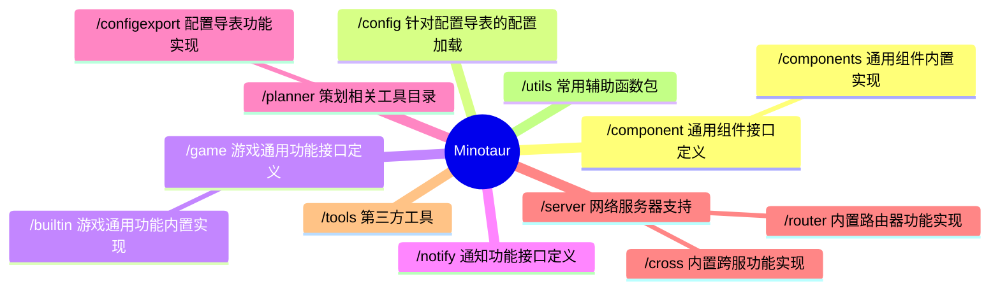

# Minotaur


Minotaur 是一个基于Golang 1.20 编写的服务端开发支持库，其中采用了大量泛型设计，用于游戏服务器开发。
> 未经严格测试，开发阶段，生产慎用！

## Server 架构预览


## 安装
注意：依赖于 **[Go](https://go.dev/) 1.18 +**

运行以下 Go 命令来安装软件包：`minotaur`
```sh
$ go get -u github.com/kercylan98/minotaur
```

## 用法
- 在`Minotaur`中大量使用了 **[泛型](https://go.dev/doc/tutorial/generics)** 、 **[观察者(事件)](https://www.runoob.com/design-pattern/observer-pattern.html)** 和 **[选项模式](https://juejin.cn/post/6844903729313873927)**，在使用前建议先进行相应了解；
- 更多的 **[示例](https://github/com/kercylan98/minotaur/examples)** 参考可在 [examples](https://github/com/kercylan98/minotaur/examples) 目录查阅；

### 简单示例
创建一个基于Websocket的回响服务器。
```go
package main

import (
	"github.com/kercylan98/minotaur/server"
)

func main() {
	srv := server.New(server.NetworkWebsocket)
	srv.RegConnectionReceiveWebsocketPacketEvent(func(srv *server.Server, conn *server.Conn, packet []byte, messageType int) {
		conn.Write(packet, messageType)
	})
	if err := srv.Run(":9999"); err != nil {
		panic(err)
	}
}
```
访问 **[WebSocket 在线测试](http://www.websocket-test.com/)** 进行验证。
> Websocket地址: ws://127.0.0.1:9999

### 事件
在 `Miontaur` 中，绝大多数场景都采用事件注册的方式进行回调，可通过`XXX.RegXXXEvent`的方式进行事件注册，例如：
```go
package main

import (
	"github.com/kercylan98/minotaur/server"
)

func main() {
	srv := server.New(server.NetworkWebsocket)
	srv.RegConsoleCommandEvent("command", nil)
	srv.RegStartBeforeEvent(nil)
	srv.RegStartFinishEvent(nil)
	srv.RegConnectionClosedEvent(nil)
	srv.RegConnectionOpenedEvent(nil)
	srv.RegConnectionReceivePacketEvent(nil)
	srv.RegConnectionReceiveWebsocketPacketEvent(nil)
	srv.RegReceiveCrossPacketEvent(nil)
	srv.RegMessageErrorEvent(nil)
	srv.RegMessageLowExecEvent(nil)
}
```
其他的一些支持事件的结构体（非所有）：
 - `game.Room` 游戏房间实现
 - `synchronization` 并发安全的`Map`实现
 - ...
### 可选项
大部分的 `New` 函数均可使用可选项进行创建，具体函数前缀通常为 `With`。
```go
package main

import (
	"github.com/kercylan98/minotaur/server"
)

func main() {
	server.New(server.NetworkWebsocket, 
		server.WithTicker(50, false),
		server.WithProd(),
		server.WithMultiCore(3),
		// ...
	)
}
```
### 更多的网络模式
```go
package main

import (
	"github.com/kercylan98/minotaur/server"
)

func main() {
	server.New(server.NetworkTcp)
	server.New(server.NetworkTcp4)
	server.New(server.NetworkTcp6)
	server.New(server.NetworkUdp)
	server.New(server.NetworkUdp4)
	server.New(server.NetworkUdp6)
	server.New(server.NetworkWebsocket)
	server.New(server.NetworkKcp)
	server.New(server.NetworkUnix)
	server.New(server.NetworkHttp)
	server.New(server.NetworkGRPC)
}
```

## 目录结构预览
