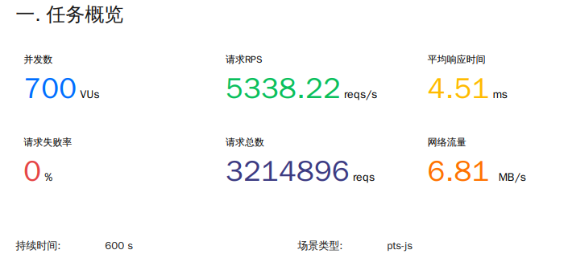
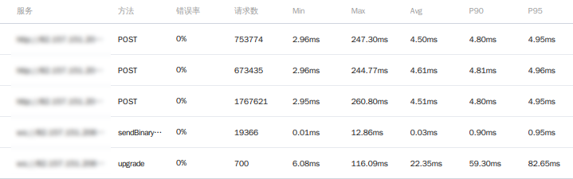
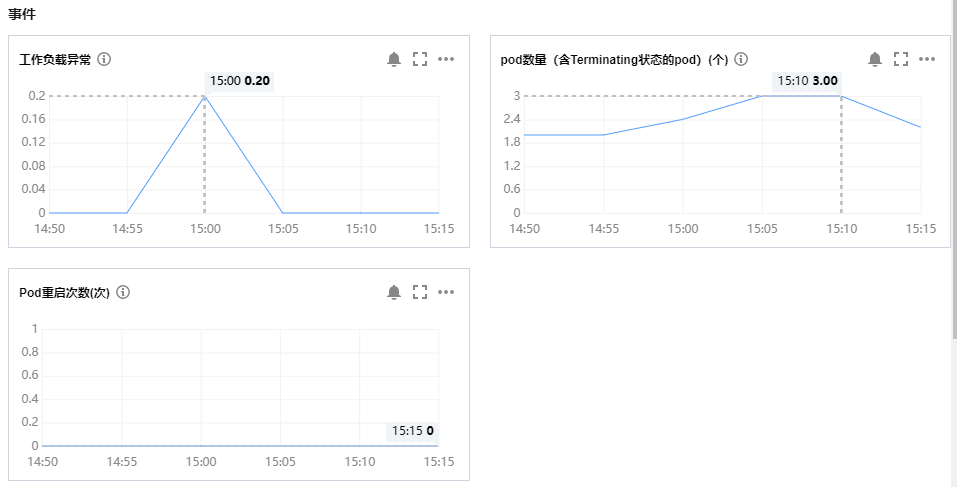
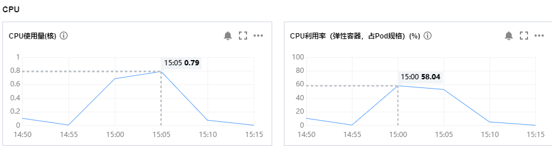
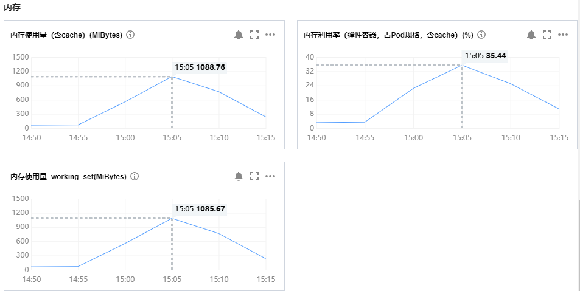
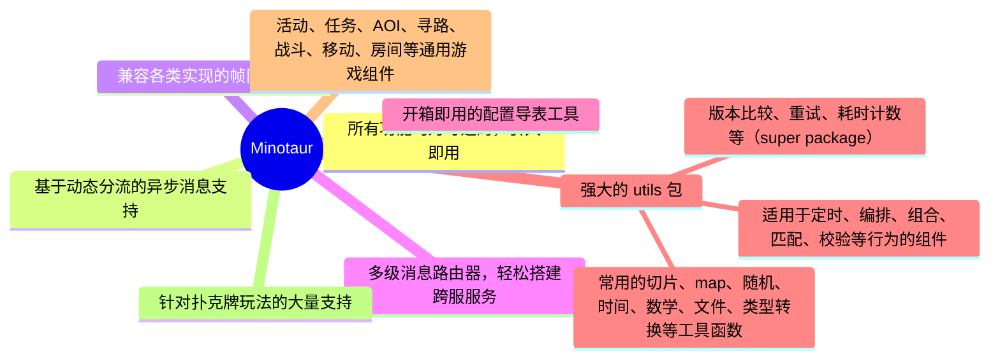
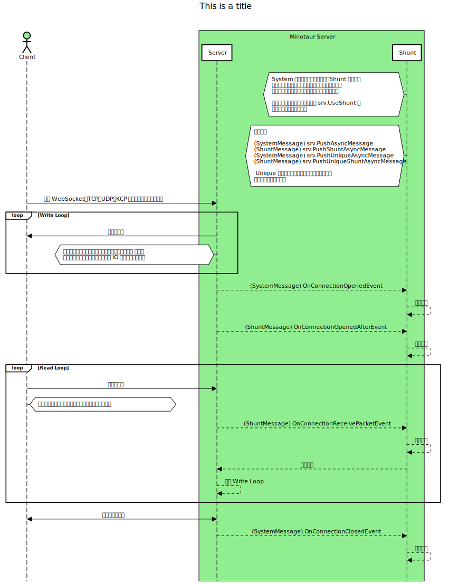

# Minotaur

Minotaur 是一个用于服务端开发的支持库，其中采用了大量泛型设计，主要被用于游戏服务器开发，但由于拥有大量通用的功能，也常被用于 WEB 开发。
***

[](https://pkg.go.dev/github.com/kercylan98/minotaur)

<a target="_blank" href="https://goreportcard.com/report/github.com/kercylan98/minotaur"></a>


> - 这是支持快速搭建多功能游戏服务器及 HTTP 服务器的 `Golang` 服务端框架；
> - 网络传输基于 [`gorilla/websocket`](https://github.com/gorilla/websocket)、[`gin-gonic/gin`](https://github.com/gin-gonic/gin)、[`grpc/grpc-go`](https://github.com/grpc/grpc-go)、[`panjf2000/gnet`](https://github.com/panjf2000/gnet)、[`xtaci/kcp-go`](https://github.com/xtaci/kcp-go) 构建；
> - 该项目的目标是提供一个简单、高效、可扩展的游戏服务器框架，让开发者可以专注于游戏逻辑的开发，而不用花费大量时间在网络传输、配置导表、日志、监控等基础功能的开发上；

***
在 Minotaur 中不包括任何跨服实现，但支持基于多级路由器快速实现跨服功能。推荐使用 [`NATS.io`](https://nats.io/) 作为跨服消息中间件。
  - 目前已实践的弹幕游戏项目以 `NATS.io` 作为消息队列，实现了跨服、埋点日志收集等功能，部署在 `Kubernetes` 集群中；
  - 该项目客户端与服务端采用 `WebSocket` 进行通讯，服务端暴露 `HTTP` 接口接收互动数据消息回调，通过负载均衡器进入 `Kubernetes` 集群中的 `Minotaur` 服务，最终通过 `NATS.io` 消息队列转发至对应所在的 `Pod` 中进行处理；

<details>
<summary>关于 Pod 配置参数及非极限压测数据</summary>

> 本次压测 `Pod` 扩容数量为 1，但由于压测连接是最开始就建立好的，所以该扩容的 `Pod` 并没有接受到压力。
> 理论上来说该 `Pod` 也应该接受 `HTTP` 回调压力，实测过程中，这个扩容的 `Pod` 没有接受到任何压力

**Pod 配置参数**


**压测结果**




**监控数据**





</details>

***

## 特色内容


## Server 架构预览


## 安装
注意：依赖于 **[Go](https://go.dev/) 1.20 +**

运行以下 Go 命令来安装软件包：`minotaur`
```sh
$ go get -u github.com/kercylan98/minotaur
```

## 用法
- 在`Minotaur`中大量使用了 **[泛型](https://go.dev/doc/tutorial/generics)** 、 **[观察者(事件)](https://www.runoob.com/design-pattern/observer-pattern.html)** 和 **[选项模式](https://juejin.cn/post/6844903729313873927)**，在使用前建议先进行相应了解；
- 项目文档可访问 **[pkg.go.dev](https://pkg.go.dev/github.com/kercylan98/minotaur)** 进行查阅；

### 本地文档
可使用 `godoc` 搭建本地文档服务器
#### 安装 godoc
```shell
git clone golang.org/x/tools
cd tools/cmd
go install ...
```
#### 使用 `godoc` 启动本地文档服务器
```shell
godoc -http=:9998 -play
```
#### Windows
```shell
.\local-doc.bat
```

#### Linux or MacOS
```shell
chmod 777 ./local-doc.sh
./local-doc.sh
```

#### 文档地址
- **[http://localhost:9998/pkg/github.com/kercylan98/minotaur/](http://localhost:9998/pkg/github.com/kercylan98/minotaur/)**
- **[https://pkg.go.dev/github.com/kercylan98/minotaur](https://pkg.go.dev/github.com/kercylan98/minotaur)**

### 简单回响服务器
创建一个基于`Websocket`创建的单线程回响服务器。
```go
package main

import (
	"github.com/kercylan98/minotaur/server"
)

func main() {
	srv := server.New(server.NetworkWebsocket)
	srv.RegConnectionReceivePacketEvent(func(srv *server.Server, conn *server.Conn, packet []byte) {
		conn.Write(packet)
	})
	if err := srv.Run(":9999"); err != nil {
		panic(err)
	}
}
```
访问 **[WebSocket 在线测试](http://www.websocket-test.com/)** 进行验证。
> Websocket地址: ws://127.0.0.1:9999

### 分流服务器
分流服务器可以将消息分流到不同的分组上，每个分组中为串行处理，不同分组之间并行处理。

> 关于分流服务器的思考：
> - 当游戏需要以房间的形式进行时，应该确保相同房间的玩家处于同一分流中，不同房间的玩家处于不同分流中，这样可以避免不同房间的玩家之间的消息互相阻塞；
>   - 这时候网络 IO 应该根据不同的游戏类型而进行不同的处理，例如回合制可以同步执行，而实时游戏应该采用异步执行；
> - 当游戏大部分时候以单人游戏进行时，应该每个玩家处于自身唯一的分流中，此时非互动的消息造成的网络 IO 采用同步执行即可，也不会阻塞到其他玩家的消息处理；
```go
package main

import "github.com/kercylan98/minotaur/server"

func main() {
	srv := server.New(server.NetworkWebsocket)
	srv.RegConnectionOpenedEvent(func(srv *server.Server, conn *server.Conn) {
		// 通过 user_id 进行分流，不同用户的消息将不会互相阻塞
		srv.UseShunt(conn, conn.Gata("user_id").(string))
	})
	srv.RegConnectionReceivePacketEvent(func(srv *server.Server, conn *server.Conn, packet []byte) {
		var roomId = "default"
		switch string(packet) {
		case "JoinRoom":
            // 将用户所处的分流渠道切换到 roomId 渠道，此刻同一分流渠道的消息将会按队列顺序处理
            srv.UseShunt(conn, roomId)
		case "LeaveRoom":
            // 将用户所处分流切换为用户自身的分流渠道
            srv.UseShunt(conn, conn.Gata("user_id").(string))
		}
	})
	if err := srv.Run(":9999"); err != nil {
		panic(err)
	}
}
```
> 该示例中模拟了用户分流渠道在自身渠道和房间渠道切换的过程，通过`UseShunt`对连接分流渠道进行设置，提高并发处理能力。

### 服务器死锁检测
`Minotaur`内置了服务器消息死锁检测功能，可通过`server.WithDeadlockDetect`进行开启。
```go
package main

import (
	"github.com/kercylan98/minotaur/server"
	"time"
)

func main() {
	srv := server.New(server.NetworkWebsocket,
		server.WithDeadlockDetect(time.Second*5),
	)
	srv.RegConnectionReceivePacketEvent(func(srv *server.Server, conn *server.Conn, packet []byte) {
		time.Sleep(10 * time.Second)
		conn.Write(packet)
	})
	if err := srv.Run(":9999"); err != nil {
		panic(err)
	}
}
```
> 在开启死锁检测的时候需要设置一个合理的死锁怀疑时间，该时间内消息没有处理完毕则会触发死锁检测，并打印`WARN`级别的日志输出。

### 计时器
在默认的`server.Server`不会包含计时器功能，可通过`server.WithTicker`进行开启，例如：
```go
package main

import "github.com/kercylan98/minotaur/server"

func main() {
	srv := server.New(server.NetworkWebsocket, server.WithTicker(-1, 50, 10, false))
	if err := srv.Run(":9999"); err != nil {
		panic(err)
	}
}
```
也可以通过`timer.GetTicker`获取计时器进行使用，例如：
```go
package main

import (
	"fmt"
	"github.com/kercylan98/minotaur/utils/timer"
	"github.com/kercylan98/minotaur/utils/times"
	"sync"
)

func main() {
	var ticker = timer.GetTicker(10)
	var wait sync.WaitGroup
	wait.Add(3)
	ticker.Loop("LOOP", timer.Instantly, times.Second, timer.Forever, func() {
		fmt.Println("LOOP")
		wait.Done()
	})
	wait.Wait()
}
```
在分布式环境中，如果存在类似于多服务器需要同时间刷新配置时，可使用`Cron`表达式设置定时任务。

### 基于`xlsx`文件的配置导出工具
该导出器的`xlsx`文件配置使用`JSON`语法进行复杂类型配置，具体可参考图例
- **[`planner/pce/exporter`](planner/pce/exporter)** 是实现了基于`xlsx`文件的配置导出工具，可直接编译成可执行文件使用；
- **[`planner/pce/exporter/xlsx_template.xlsx`](planner/pce/exporter/xlsx_template.xlsx)** 是导出工具的模板文件，其中包含了具体的规则说明。
- 模板文件图例：


#### 导出 JSON 文件（可供客户端直接使用，包含索引的配置导出后为键值模式，可直接读取）
```text
Flags:
  -e, --exclude string   excluded configuration names or display names (comma separated) | 排除的配置名或显示名（英文逗号分隔）
  -h, --help             help for json
  -o, --output string    directory path of the output json file | 输出的 json 文件所在目录路径
  -p, --prefix string    export configuration file name prefix | 导出配置文件名前缀
  -t, --type string      export server configuration[s] or client configuration[c] | 导出服务端配置[s]还是客户端配置[c]
  -f, --xlsx string      xlsx file path or directory path | xlsx 文件路径或所在目录路径

```
```shell
expoter.exe json -t s -f xlsx_template.xlsx -o ./output
```
导出结果示例
```json
{
  "1": {
    "b": {
      "Id": 1,
      "Count": "b",
      "Info": {
        "id": 1,
        "name": "小明",
        "info": {
          "lv": 1,
          "exp": {
            "mux": 10,
            "count": 100
          }
        }
      },
      "Other": [
        {
          "id": 1,
          "name": "张飞"
        },
        {
          "id": 2,
          "name": "刘备"
        }
      ]
    }
  }
}

```

#### 导出 Golang 文件
```text
Flags:
  -e, --exclude string   excluded configuration names or display names (comma separated) | 排除的配置名或显示名（英文逗号分隔）
  -h, --help             help for go
  -o, --output string    output path | 输出的 go 文件路径
  -f, --xlsx string      xlsx file path or directory path | xlsx 文件路径或所在目录路径
```
```shell
expoter.exe go -f xlsx_template.xlsx -o ./output
```
使用示例

```go
package main

import (
	"fmt"
	"config"
)

func main() {
	fmt.Println(config.EasyConfig.Id)
}
```

### 持续更新的示例项目
- **[Minotaur-Example](https://github.com/kercylan98/minotaur-example)**

### 贡献者列表
<a href="https://github.com/kercylan98/minotaur/graphs/contributors">
  
</a>

#### 参与贡献请参考 **[CONTRIBUTING.md](CONTRIBUTING.md)** 贡献指南。

### 联系方式
- **[Email: kercylan@gmail.com](mailto:kercylan@gmail.com)**
- **[Telegram: ziv_siren](https://telegram.me/ziv_siren)**

# JetBrains OS licenses

`Minotaur` had been being developed with `GoLand` IDE under the **free JetBrains Open Source license(s)** granted by JetBrains s.r.o., hence I would like to express my thanks here.

<a href="https://www.jetbrains.com/?from=minotaur" target="_blank"></a>